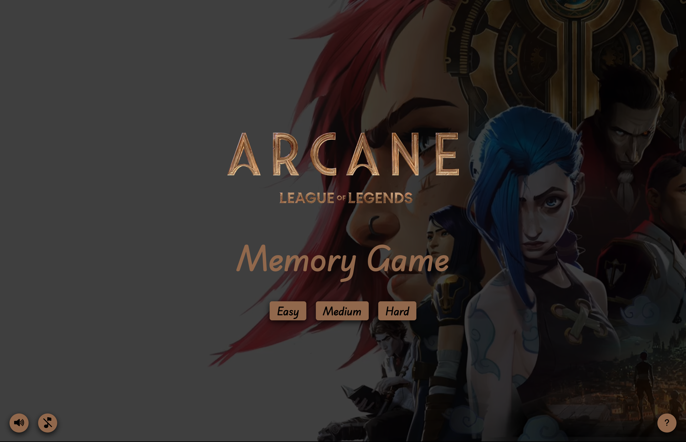
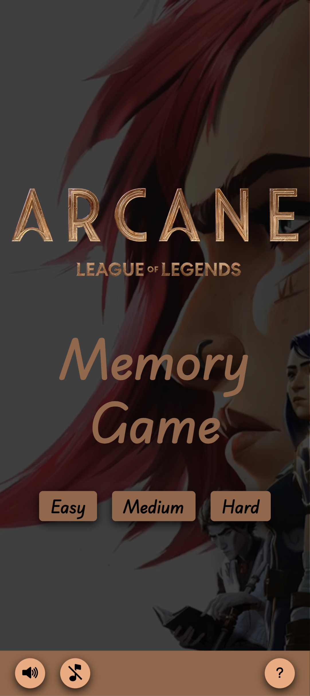
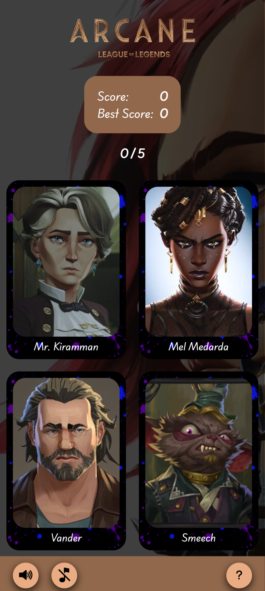

# Memory Card Game

A React-based memory game themed around **Arcane: League of Legends** — test how sharp your recall really is by clicking through character cards without repeating one.

**[Play the live demo](https://memory-card-game-eight-self.vercel.app/)**

## About

This is a simple game that tests your memory - can you recall what you just saw? Depending on the difficulty level selected, there are a number of cards featuring characters from the *Arcane: League of Legends* animated series. All you have to do is keep selecting new cards and avoid selecting the same card twice.

A progress and score tracker shows how many more clicks you need to win, along with your current score and best score.

## How It Works

1. Choose a difficulty level: **Easy**, **Medium**, or **Hard**.
2. Click any card you like.
3. Click a different, unselected card to keep going — the cards reshuffle after every selection.
4. Keep going without repeating a character to increase your score.
5. Select a card you've already picked, and the game ends.
6. Match the target number of unique cards (shown in the progress tracker) to win.

## Screenshots

| Home — Select Difficulty | Gameplay |
| --- | --- |
|  |  |

| Mobile — Select Difficulty | Mobile Gameplay |
| --- | --- |
|  |  |

## Features

- Multiple difficulty levels
- Score tracking
- Best score persistence
- Card flip and tilt animations
- Sound effects with a sound toggle
- Responsive design (desktop and mobile)
- Character images and data pulled from a live API
- Randomized card shuffling on every move

## Technologies Used

- [React](https://react.dev/)
- JavaScript
- CSS
- [Vite](https://vitejs.dev/)
- [ESLint](https://eslint.org/)
- [react-parallax-tilt](https://www.npmjs.com/package/react-parallax-tilt) for the card tilt animation

## API / External Resources

Character images and bios are fetched from the [TVmaze API](https://api.tvmaze.com):

```
https://api.tvmaze.com/shows/55138/cast
```

## Installation

This project uses a standard Vite setup.

```bash
# Clone the repository
git clone https://github.com/AdjeteySowah/memory-card-game.git
cd memory-card-game

# Install dependencies
npm install

# Start the dev server
npm run dev
```

Then open the local URL Vite prints in your terminal (usually `http://localhost:5173`).

## What I Learned

- How to structure a React project, including feature-based vs. file-type-based folder structures, and how to organize components and their CSS files.
- How to decide where helper functions should live.
- How to use the functional form of a state setter when logic depends on the previous state.
- How a child component's click event can trigger a parent's handler through event propagation.
- How to use `useEffect` for side effects such as fetching data and timers.
- How to use `AbortController` to cancel an ongoing fetch request.
- How browser caching can affect API requests and page behavior.
- How to stage specific changes or individual hunks rather than staging an entire file.
- How React batches multiple state updates within the same event loop tick, so related updates happen together for efficiency.
- How to abstract logic into reusable hooks, making components leaner.

## Credits / Attribution

- **API:** Character data and images courtesy of the [TVmaze API](https://api.tvmaze.com).
- **Design inspiration:** [alex-dishen.github.io/memory-card](https://alex-dishen.github.io/memory-card/)
- **Project idea:** [The Odin Project — Memory Card](https://www.theodinproject.com/lessons/node-path-react-new-memory-card)
